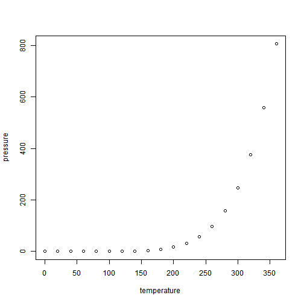

# Reticulate 

Text in my chapter. More text. Even more text.


```python
import pandas as pd
d = {"one": [1.0, 2.0, 3.0, 4.0], "two": [4.0, 3.0, 2.0, 1.0]}
dd = pd.DataFrame(d)
dd
```

```
##    one  two
## 0  1.0  4.0
## 1  2.0  3.0
## 2  3.0  2.0
## 3  4.0  1.0
```


```r
py$dd
```

```
##   one two
## 1   1   4
## 2   2   3
## 3   3   2
## 4   4   1
```


```r
ddd = data.frame(a = 1:3, b=3:5)
ddd
```

```
##   a b
## 1 1 3
## 2 2 4
## 3 3 5
```


```python
r.ddd
```

```
##    a  b
## 0  1  3
## 1  2  4
## 2  3  5
```


# Dygraphs


```r
library(dplyr)
```

```
## Warning: package 'dplyr' was built under R version 3.6.3
```

```
## 
## Attaching package: 'dplyr'
```

```
## The following objects are masked from 'package:stats':
## 
##     filter, lag
```

```
## The following objects are masked from 'package:base':
## 
##     intersect, setdiff, setequal, union
```

```r
library(dygraphs)
```

```
## Warning: package 'dygraphs' was built under R version 3.6.3
```

```r
dygraph(nhtemp, main = "New Haven Temperatures") %>%
  dyRangeSelector(dateWindow = c("1920-01-01", "1960-01-01"))
```


# KableExtra


```r
library(knitr)
library(kableExtra)
```

```
## Registered S3 method overwritten by 'rvest':
##   method            from
##   read_xml.response xml2
```

```
## 
## Attaching package: 'kableExtra'
```

```
## The following object is masked from 'package:dplyr':
## 
##     group_rows
```

```r
library(formattable)
```

```
## Warning: package 'formattable' was built under R version 3.6.1
```

```r
ft_dt <- mtcars[1:5, 1:4]
ft_dt$car <- row.names(ft_dt)
row.names(ft_dt) <- NULL
ft_dt$mpg <- color_tile("white", "orange")(ft_dt$mpg)
ft_dt$cyl <- cell_spec(ft_dt$cyl, angle = (1:5)*60, 
                      background = "red", color = "white", align = "center")
ft_dt$disp <- ifelse(
  ft_dt$disp > 200,
  cell_spec(ft_dt$disp, color = "red", bold = T),
  cell_spec(ft_dt$disp, color = "green", italic = T)
)
ft_dt$hp <- color_bar("lightgreen")(ft_dt$hp)
ft_dt <- ft_dt[c("car", "mpg", "cyl", "disp", "hp")]

kable(ft_dt, escape = F) %>%
  #kable_paper("hover", full_width = F) %>%
  column_spec(5, width = "3cm") %>%
  add_header_above(c(" ", "Hello" = 2, "World" = 2))
```

<table>
 <thead>
<tr>
<th style="border-bottom:hidden" colspan="1"></th>
<th style="border-bottom:hidden; padding-bottom:0; padding-left:3px;padding-right:3px;text-align: center; " colspan="2"><div style="border-bottom: 1px solid #ddd; padding-bottom: 5px; ">Hello</div></th>
<th style="border-bottom:hidden; padding-bottom:0; padding-left:3px;padding-right:3px;text-align: center; " colspan="2"><div style="border-bottom: 1px solid #ddd; padding-bottom: 5px; ">World</div></th>
</tr>
  <tr>
   <th style="text-align:left;"> car </th>
   <th style="text-align:left;"> mpg </th>
   <th style="text-align:left;"> cyl </th>
   <th style="text-align:left;"> disp </th>
   <th style="text-align:left;"> hp </th>
  </tr>
 </thead>
<tbody>
  <tr>
   <td style="text-align:left;"> Mazda RX4 </td>
   <td style="text-align:left;"> <span style="display: block; padding: 0 4px; border-radius: 4px; background-color: #ffcc6f">21.0</span> </td>
   <td style="text-align:left;"> <span style="-webkit-transform: rotate(60deg); -moz-transform: rotate(60deg); -ms-transform: rotate(60deg); -o-transform: rotate(60deg); transform: rotate(60deg); display: inline-block; "><span style="     color: white !important;border-radius: 4px; padding-right: 4px; padding-left: 4px; background-color: red !important;text-align: center;">6</span></span> </td>
   <td style="text-align:left;"> <span style="  font-style: italic;   color: green !important;">160</span> </td>
   <td style="text-align:left;width: 3cm; "> <span style="display: inline-block; direction: rtl; border-radius: 4px; padding-right: 2px; background-color: lightgreen; width: 62.86%">110</span> </td>
  </tr>
  <tr>
   <td style="text-align:left;"> Mazda RX4 Wag </td>
   <td style="text-align:left;"> <span style="display: block; padding: 0 4px; border-radius: 4px; background-color: #ffcc6f">21.0</span> </td>
   <td style="text-align:left;"> <span style="-webkit-transform: rotate(120deg); -moz-transform: rotate(120deg); -ms-transform: rotate(120deg); -o-transform: rotate(120deg); transform: rotate(120deg); display: inline-block; "><span style="     color: white !important;border-radius: 4px; padding-right: 4px; padding-left: 4px; background-color: red !important;text-align: center;">6</span></span> </td>
   <td style="text-align:left;"> <span style="  font-style: italic;   color: green !important;">160</span> </td>
   <td style="text-align:left;width: 3cm; "> <span style="display: inline-block; direction: rtl; border-radius: 4px; padding-right: 2px; background-color: lightgreen; width: 62.86%">110</span> </td>
  </tr>
  <tr>
   <td style="text-align:left;"> Datsun 710 </td>
   <td style="text-align:left;"> <span style="display: block; padding: 0 4px; border-radius: 4px; background-color: #ffa500">22.8</span> </td>
   <td style="text-align:left;"> <span style="-webkit-transform: rotate(180deg); -moz-transform: rotate(180deg); -ms-transform: rotate(180deg); -o-transform: rotate(180deg); transform: rotate(180deg); display: inline-block; "><span style="     color: white !important;border-radius: 4px; padding-right: 4px; padding-left: 4px; background-color: red !important;text-align: center;">4</span></span> </td>
   <td style="text-align:left;"> <span style="  font-style: italic;   color: green !important;">108</span> </td>
   <td style="text-align:left;width: 3cm; "> <span style="display: inline-block; direction: rtl; border-radius: 4px; padding-right: 2px; background-color: lightgreen; width: 53.14%">93</span> </td>
  </tr>
  <tr>
   <td style="text-align:left;"> Hornet 4 Drive </td>
   <td style="text-align:left;"> <span style="display: block; padding: 0 4px; border-radius: 4px; background-color: #ffc357">21.4</span> </td>
   <td style="text-align:left;"> <span style="-webkit-transform: rotate(240deg); -moz-transform: rotate(240deg); -ms-transform: rotate(240deg); -o-transform: rotate(240deg); transform: rotate(240deg); display: inline-block; "><span style="     color: white !important;border-radius: 4px; padding-right: 4px; padding-left: 4px; background-color: red !important;text-align: center;">6</span></span> </td>
   <td style="text-align:left;"> <span style=" font-weight: bold;    color: red !important;">258</span> </td>
   <td style="text-align:left;width: 3cm; "> <span style="display: inline-block; direction: rtl; border-radius: 4px; padding-right: 2px; background-color: lightgreen; width: 62.86%">110</span> </td>
  </tr>
  <tr>
   <td style="text-align:left;"> Hornet Sportabout </td>
   <td style="text-align:left;"> <span style="display: block; padding: 0 4px; border-radius: 4px; background-color: #ffffff">18.7</span> </td>
   <td style="text-align:left;"> <span style="-webkit-transform: rotate(300deg); -moz-transform: rotate(300deg); -ms-transform: rotate(300deg); -o-transform: rotate(300deg); transform: rotate(300deg); display: inline-block; "><span style="     color: white !important;border-radius: 4px; padding-right: 4px; padding-left: 4px; background-color: red !important;text-align: center;">8</span></span> </td>
   <td style="text-align:left;"> <span style=" font-weight: bold;    color: red !important;">360</span> </td>
   <td style="text-align:left;width: 3cm; "> <span style="display: inline-block; direction: rtl; border-radius: 4px; padding-right: 2px; background-color: lightgreen; width: 100.00%">175</span> </td>
  </tr>
</tbody>
</table>


## GitHub Documents

This is an R Markdown format used for publishing markdown documents to GitHub. When you click the **Knit** button all R code chunks are run and a markdown file (.md) suitable for publishing to GitHub is generated.

## Including Code

You can include R code in the document as follows:


```r
summary(cars)
```

```
##      speed           dist       
##  Min.   : 4.0   Min.   :  2.00  
##  1st Qu.:12.0   1st Qu.: 26.00  
##  Median :15.0   Median : 36.00  
##  Mean   :15.4   Mean   : 42.98  
##  3rd Qu.:19.0   3rd Qu.: 56.00  
##  Max.   :25.0   Max.   :120.00
```

## Including Plots

You can also embed plots, for example:



Note that the `echo = FALSE` parameter was added to the code chunk to prevent printing of the R code that generated the plot.
